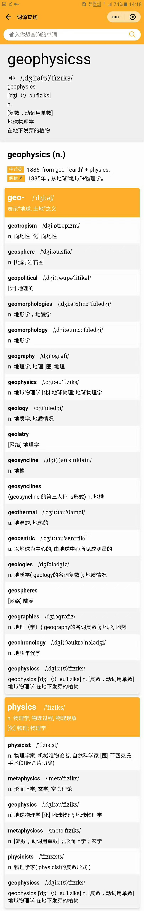
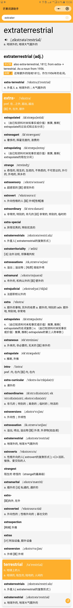

## 芒果词源助手

使用https://www.etymonline.com/ 做的一个微信小程序，用于查询词源，并且拓展了功能，查询某个单词时，显示同根词源派生的单词，并且可以选择单词范围（CET-4、CET-6、托福、雅思）等等。

### 主要目录
1. `cmd/etymd/`服务器守护进程
2. `cmd/spider/`爬虫程序，从etymonline爬取词源信息，并解析其中的词根词缀派生关系，以及使用google翻译获取汉语词源，由于google翻译有反爬虫设计，所以在`pkg/proxy`中实现了一个代理池，从公共HTTP代理网站拉取HTTP代理信息，检测活的代理进行爬取。
3. `cmd/transformer`数据处理以及转换，单词翻译使用了`https://github.com/skywind3000/ECDICT`，需要对原始数据进行处理。
4. `assets`资源文件，里面包含各种解析好的资源。
5. `build` 编译打包部署到远程服务器相关脚本，`build/unpack.sh`用于解压必要文件

### `assets`目录
1. `ecdict.json` 对应`https://github.com/skywind3000/ECDICT`中的ecdict词典(70w词条)
2. `stardict.json` 对应`https://github.com/skywind3000/ECDICT`中的stardict词典(350万词条)
3. `etym.json` 从etymonline.com拉取的词条解析后的文件(包含词源翻译)
4. `trans.json` 翻译文件
5. `ECDICT.tar.gz` 当前使用的`https://github.com/skywind3000/ECDICT`
6. `etymology-resource.tar.gz` 从etymolone中爬取的原始数据以及从google翻译中爬取的原始数据，可以使用`spider`重新爬取，也可以直接使用已经爬好的数据玩耍。
7. 其他文件cet-4、cet-6相关的文件都是字典文件，小程序可以选择首页随机单词范围，可以在这些文件中随机

### 如何使用
由于github单文件限制大小100m, 所有assets部分文件进行了压缩, 请先解压文件, 可以使用
```
sh build/unpack.sh
```

### 小程序截图



